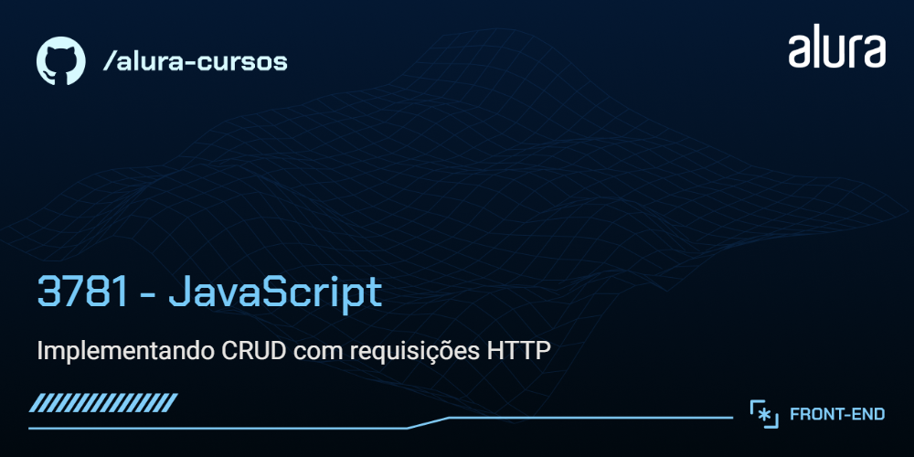

<<<<<<< HEAD


# Memoteca

Memoteca é um aplicativo organizador de pensamentos e frases que permite cadastrar, listar, editar e deletar pensamentos, incluindo informações como conteúdo e autoria.

## 🔨 Funcionalidades do projeto

`Cadastro de pensamentos`: Permite adicionar novos pensamentos à lista, inserindo informações como conteúdo e autoria.

`Listagem de pensamentos`: Exibe os pensamentos cadastrados, permitindo visualizar o texto e a autoria.

`Edição de pensamentos`: Permite editar pensamentos existentes, atualizando as informações conforme necessário.

`Exclusão de pensamentos`: Permite remover pensamentos da lista.

## ✔️ Técnicas e tecnologias utilizadas

`JavaScript`: Linguagem de programação utilizada para desenvolver a lógica do aplicativo.

`Fetch API`: Utilizada para realizar requisições HTTP para comunicação com o servidor.

`Axios`: Biblioteca usada para facilitar e simplificar as requisições HTTP.

`Node.js`: Plataforma utilizada para executar o ambiente de desenvolvimento.

`JSON Server`: Utilizado para simular um backend e facilitar o desenvolvimento e teste das operações CRUD.

`CSS`: Utilizado para estilização da interface do aplicativo.


## 📁 Link do Figma

Você pode [acessar o figma do projeto aqui](https://www.figma.com/design/Sz1gmmemxqcB3amInL4Ndp/Rebrand-Memoteca-%7C-Curso-CRUD?node-id=148-26&t=FpdmfbiM1i1s6REQ-0).

## 🛠️ Abrir e rodar o projeto

Para executar a API fake, você vai precisar do NodeJS; a versão utilizada foi a 20.12.2.

Instale o JSON Server globalmente (se ainda não estiver instalado):

```bash
npm install -g json-server
```

Para executar, abra um novo terminal e, dentro da pasta backend, execute:

```bash
npm start
```

Acesse o backend localmente em seu navegador:

http://localhost:3000

Para executar o frontend, abra o projeto no Visual Studio Code. Com a extensão Live Server instalada, clique com o botão direito no arquivo index.html e selecione "Open with Live Server" no menu de contexto.

Acesse o frontend localmente em seu navegador:

http://localhost:5500
=======
# memoteca
Projeto desenvolvido através do curso "JavaScript: implementando CRUD com requisições HTTP" da Alura.
>>>>>>> 895f201490c0e7a4154fd69801fa8a1894dac58e
